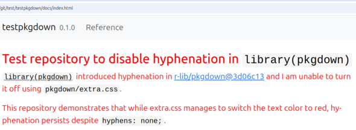

<!-- README.md is generated from README.Rmd. Please edit that file -->

## Test repository to disable hyphenation in `library(pkgdown)`

`library(pkgdown)` introduced hyphenation in
[r-lib/pkgdown@3d06c13](https://github.com/r-lib/pkgdown/commit/3d06c13cdc253b0cf6f915c073c46ee27b70da2b)
and I was unable to turn it off using `pkgdown/extra.css`.

FIX: The CSS selector should be `.row > main`, not e.g. `body`.

I’m leaving the rest of the issue description for posteriority in case
this trips anybody else up.

------------------------------------------------------------------------

This repository demonstrates that while extra.css manages to switch the
text color to red, hyphenation persists despite `hyphens: none;`.

To reproduce:

- RStudio \> File \> New Project \> New Directory \> R package

- usethis::use_pkgdown()

- pkgdown::build_site()

- Observe that the word para-graphs gets hyphenated in the default
  package description. (Adding README.Rmd will override the front page,
  but we can see the word hy-phenation instead.)

- Try to override CSS in pkgdown/extra.css:

      body {
        color: red;
        hyphens: none !important;
      }

  and re-run pkgdown::build_site(). The text gets red, but the hyphens
  persist.

SOLUTION: Use

      .row > main {
        color: red;
        hyphens: none;
      }

instead.
